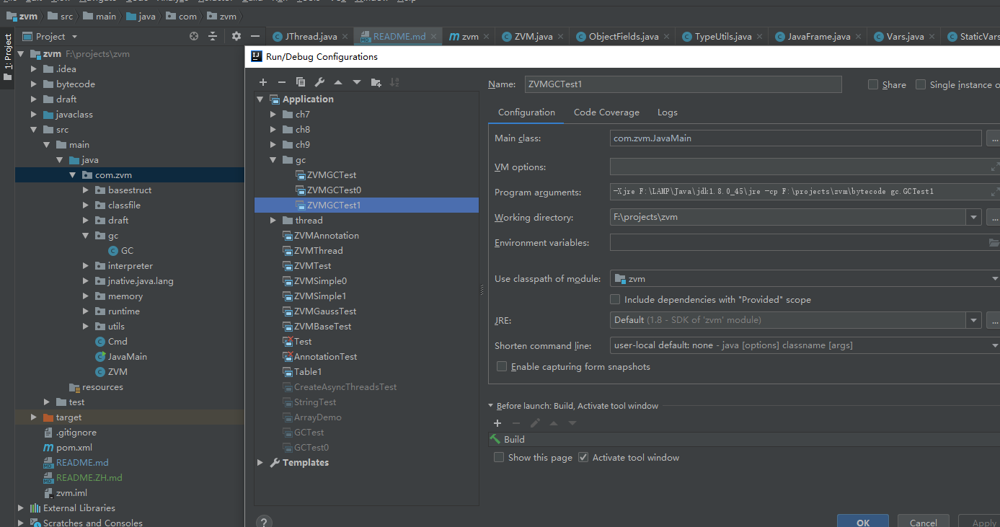
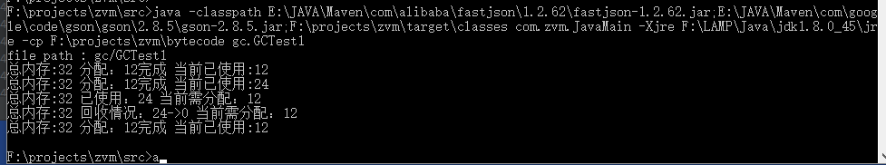

Java实现简易JVM
#  主要模块和样例：
<details>
    <summary>1. 读取并解析class文件，如String、Thread等类(支持jdk8及以下)</summary>

部分类可能在demo运行时用到:
+ `zvm\bytecode\java\lang\System.class `
+ `zvm\bytecode\java\io\PrintStream.class  `
+ `zvm\bytecode\java\lang\Thread.class`
+ `zvm\bytecode\com\zvm\javaclass\integer\Table1.class(注解相关)`
</details>
<details>
<summary>2. 取opcode，解释执行程序。循环运算，入栈出栈</summary>

- 执行样例：
```java
public class GaussTest {
    public GaussTest() {
    }
    public static void main(String[] args) {
        int sum = 0;
        for(int i = 5; i <= 20; i += 10) {
            sum += i;
        }
        System.out.println(sum);
    }
}
```

输出结果：
```java
file path : GaussTest
20
```
</details>
<details>
<summary>3. 方法调用(静态方法、构造方法、实例方法(支持继承多态))</summary>

- 静态递归方法执行样例(invokestatic)：
```java
public class FibonacciTest {
    public static void main(String[] args) {
        long x = fibonacci(8);
        System.out.println(x);
    }
    private static long fibonacci(long n) {
        if (n <= 1) {
            return n;
        } else {
            return fibonacci(n - 1) + fibonacci(n - 2);
        }
    }
}
```

输出结果：
```java
file path : FibonacciTest
21
```

- 构造方法调用(invokespecial)
```java
public class FibonacciTest {
    public static void main(String[] args) {
        long x = fibonacci(8);
        System.out.println(x);
    }
    private static long fibonacci(long n) {
        if (n <= 1) {
            return n;
        } else {
            return fibonacci(n - 1) + fibonacci(n - 2);
        }
    }
}
```

输出结果：
```java
file path : FibonacciTest
21
```

- 调用实例方法，支持继承多态(invokevirtual)
```java
public class InvokeVirtualTest {
    public static void main(String[] args) {
        Vector2D v2 = new Vector2D(2.1, 2.2);
        Vector2D v3 = new Vector3D(3.1, 3.2, 3.3);
        v2.multiply(2);
        v3.multiply(3);
        System.out.println(v2.x);
        System.out.println(v2.y);
        System.out.println(v3.x);
        System.out.println(v3.y);
        System.out.println(((Vector3D)v3).z);
    }
}
```

输出结果：
```java
file path : ch07/InvokeVirtualTest
4.2
4.4
9.3
9.600000000000001
9.899999999999999
```
</details>
<details>
<summary>4. 数组</summary>

- 一维int数组冒泡排序：
```java
public class BubbleSortTest {
    public static void main(String[] args) {
        int[] arr = {
            22, 84, 77, 11, 95,  9, 78, 56,
            36, 97, 65, 36, 10, 24 ,92, 48
        };
        //printArray(arr);
        bubbleSort(arr);
        //System.out.println(123456789);
        printArray(arr);
    }
    private static void bubbleSort(int[] arr) {
        boolean swapped = true;
        int j = 0;
        int tmp;
        while (swapped) {
            swapped = false;
            j++;
            for (int i = 0; i < arr.length - j; i++) {
                if (arr[i] > arr[i + 1]) {
                    tmp = arr[i];
                    arr[i] = arr[i + 1];
                    arr[i + 1] = tmp;
                    swapped = true;
                }
            }
        }
    }
    private static void printArray(int[] arr) {
        for (int i : arr) {
            System.out.println(i);
        }
    }
}
```
输出结果：
```java
file path : ch08/BubbleSortTest
9
10
...
```

- 一维double数组冒泡排序
```java
public class DoubleBubbleSortTest {
    public static void main(String[] args) {
        double[] arr = {
            22.2, 84.4, 77.5, 11.2, 95.3,  9.2, 78.2, 56.2,
            36.1, 97.1, 65.1, 36.1, 10.3, 24.3 ,92.3, 48.3
        };

        //printArray(arr);
        bubbleSort(arr);
        //System.out.println(123456789);
        printArray(arr);
    }
    private static void bubbleSort(double[] arr) {
        boolean swapped = true;
        int j = 0;
        double tmp;
        while (swapped) {
            swapped = false;
            j++;
            for (int i = 0; i < arr.length - j; i++) {
                if (arr[i] > arr[i + 1]) {
                    tmp = arr[i];
                    arr[i] = arr[i + 1];
                    arr[i + 1] = tmp;
                    swapped = true;
                }
            }
        }
    }
    private static void printArray(double[] arr) {
        for (double i : arr) {
            System.out.println(i);
        }
    }
}

```

输出结果：
```java
file path : ch08/DoubleBubbleSortTest
9.2
10.3
11.2
22.2
24.3
...
```

</details>

<details>
<summary>5. 字符串和字符串数组</summary>

- 字符串加法，涉及类有java/lang/StringBuilder、java/lang/AbstractStringBuilder、java/lang/Math
、java/util/Arrays、java/io/FilterOutputStream、java/io/OutputStream、 java/io/PrintStream、java/lang/String：
```java
public class StringBuilderTest {
    public static void main(String[] args) {
        String hello = "hello,";
        String world = "world!";
        String str = hello + world;
        System.out.println(str);
    }
}
```
输出结果：
```java
file path : ch09/StringBuilderTest
总内存:8912 分配：8完成 当前已使用:8
总内存:8912 分配：12完成 当前已使用:20
...
hello,world!
...
```

- 字符串数组
```java
public class ArrayDemo {
    public static void main(String[] args) {
        int[] a1 = new int[10];       // newarray
        String[] a2 = new String[10]; // anewarray
        //int[][] a3 = new int[10][10]; // multianewarray
        int x = a1.length;            // arraylength
        a1[0] = 100;                  // iastore
        int y = a1[0];                // iaload
        a2[0] = "0abc";                // aastore
        String s = a2[0];             // aaload
        System.out.println( s);
        a2[1] = "1xxxxyyxyy";
        a2[2] = "2xxxxyyxyy";

        for(int i = 0; i < 3; i++){
            System.out.println(a2[i] + " stringbuilderTest");
        }
    }
}
```

输出结果：
```java
file path : ch09/ArrayDemo
总内存:8912 分配：40完成 当前已使用:40
...
0abc
总内存:8912 分配：8完成 当前已使用:104
总内存:8912 分配：20完成 当前已使用:124
...
0abc stringbuilderTest
总内存:8912 分配：8完成 当前已使用:364
总内存:8912 分配：32完成 当前已使用:396
...
1xxxxyyxyy stringbuilderTest
总内存:8912 分配：8完成 当前已使用:580
总内存:8912 分配：32完成 当前已使用:612
...
2xxxxyyxyy stringbuilderTest
...
```
</details>

<details>
<summary>6. 调用本地方法</summary>

- 只实现了这个方法println，里面调用了arraycopy
```java
public class StringBuilderTest {
    public static void main(String[] args) {
        String hello = "hello,";
        String world = "world!";
        String str = hello + world;
        System.out.println(str);
    }
}
```
输出结果：
```java
file path : ch09/StringBuilderTest
hello,world!
```
</details>

<details>
<summary>7. GC相关：简单实现了标记清除算法</summary>

- 在zvm\src\main\java\com\zvm\memory\JavaHeap.java的HEAP_MAX_SIZE(此例中为32)的大小
```java
public class GCTest1 {
    private static final int SIZE = 3;
    public static void main(String[] args){
        test0();
        test1();
        test2();
    }
    private static void test0() {
        /*字符串会创建22 byte + 8byte的数组:8byte:为String对象，22byte为char[11]*/
        //System.out.println("test0 start");
        int[] arr = new int[SIZE];
        for (int i = 0; i < SIZE; i++){
            arr[i] = 100 + i;
        }
        //System.out.println("test0 start");
    }

    private static void test1() {
        //System.out.println("test1 start");
        int[] arr = new int[SIZE];
        for (int i = 0; i < SIZE; i++){
            arr[i] = 100 + i;
        }
        //System.out.println("test1 start");
    }

    private static void test2() {
        //System.out.println("test2 start");
        int[] arr = new int[SIZE];
        for (int i = 0; i < SIZE; i++){
            arr[i] = 100 + i;
        }
        //System.out.println("test2 start");
    }
}
```
输出结果：
```java
file path : gc/GCTest1
总内存:32 分配：12完成 当前已使用:12
总内存:32 分配：12完成 当前已使用:24
总内存:32 已使用：24 当前需分配：12
总内存:32 回收情况：24->0 当前需分配：12
总内存:32 分配：12完成 当前已使用:12
```
</details>

### 其他 demo
<details>
<summary>1. 嵌套类</summary>

- 执行样例：
```java
/**
 1. 嵌套类：
    - 静态嵌套类；
    Classes
        - 普通内部类(成员内部类)
        - 局部内部类
        - 匿名内部类
 https://docs.oracle.com/javase/tutorial/java/javaOO/nested.html
 */
public class T0NestedClass {
    static class StaticClass{
        public String staticClassKey = "staticClassVale";
        public void test(){
            System.out.println(staticClassKey);
        }
    }

    /**
     * 普通内部类
     */
    class GenaralClass{
        public String genaralClassKey = "genaralClassValue";
        public void test(){
            System.out.println(genaralClassKey);
        }
    }

    public static void main(String[] args){
        class LocalClass{
            public String localClassKey = "LocalClassValue";
            public void test(){
                System.out.println(localClassKey);
            }
        }

        AnonymousClass anonymousClass = new AnonymousClass(){
            public String anonymousClassKey = "anonymousClassValue";
            public void test(){
                System.out.println(anonymousClassKey);
            }
        };

        /*静态类测试*/
        StaticClass staticClass = new StaticClass();
        staticClass.test();

        /*普通内部类测试*/
        new T0NestedClass().generalClassTest();

        /*局部内部类测试*/
        LocalClass localClass = new LocalClass();
        localClass.test();

        /*匿名内部类测试*/
        anonymousClass.test();

    }

    public void generalClassTest(){
        GenaralClass genaralClass = new GenaralClass();
        genaralClass.test();
    }
}
class AnonymousClass{
    public void test() {
    }
}
```

输出结果：
```java
file path : nestedclass\T0NestedClass
总内存:32000 分配：4完成 当前已使用:4
...
staticClassVale
总内存:32000 分配：0完成 当前已使用:92
总内存:32000 分配：8完成 当前已使用:100
总内存:32000 分配：8完成 当前已使用:108
总内存:32000 分配：34完成 当前已使用:142
genaralClassValue
总内存:32000 分配：4完成 当前已使用:146
总内存:32000 分配：8完成 当前已使用:154
总内存:32000 分配：30完成 当前已使用:184
LocalClassValue
anonymousClassValue

```
</details>

<details>
<summary>2. 类的加载、链接、初始化</summary>

- 执行样例：
```java
public class T1ClassLink {
    public static String value1 = "abc";
    public static final String finalValue = "zvm";
    public static String[] arr = new String[]{"arr0", "arr1", "dsafasfsdafd"};
    public static final String[] finalArr = new String[]{"final-arr0", "final-arr1", "final-dsafasfsdafd"};
    public String generalStr = "generalStr";

    public T1ClassLink() {
    }

    public static void main(String[] var0) {
        System.out.println(value1);
        System.out.println("zvm");
        System.out.println(arr[0]);
        System.out.println(finalArr[0]);
        System.out.println((new T1ClassLink()).generalStr);
    }
}
```

输出结果：
```java
file path : classlink\T1ClassLink
总内存:32000 分配：0完成 当前已使用:0
...
abc
总内存:32000 分配：8完成 当前已使用:210
总内存:32000 分配：6完成 当前已使用:216
zvm
总内存:32000 分配：8完成 当前已使用:224
...
arr0
总内存:32000 分配：8完成 当前已使用:426
...
final-arr0
总内存:32000 分配：4完成 当前已使用:624
...
generalStr

```
</details>

### 计划要实现
- 反射
- 多线程
- 同步

# 怎么运行
<details>
<summary>1. 环境 </summary>

- 在Windows10，基于jdk8开发
- 打印调试信息，可能需要maven引入Gson或fastjson
- 支持解析jdk8及以下版本的类，解释执行demo
- 经测试，demo支持在linux,jdk8中运行  
</details>

<details>
<summary>2. IDEA运行 </summary>   


</details>

<details>
<summary>3. cmd运行 </summary>   

```bash
F:\projects\zvm>java -classpath E:\JAVA\Maven\com\alibaba\fastjson\1.2.62\fastjson-1.2.62.jar;E:\JAVA\Maven\com\google\code\gson\gson\2.8.5\gson-2.8.5.jar;F:\projects\zvm\target\classes com.zvm.JavaMain -cp F:\projects\zvm\bytecode gc.GCTest1
```
运行结果：  

</details>

# 目录结构
<details>
<summary>1. 第一级目录</summary>  

```
bytecode\  #编译后的字节文件
javaclass\ #测试demo的源文件
src\       #源代码
```

注：由jdk1.8.0_45\jre\lib\rt.jar中的java文件夹得到zvm\bytecode\java文件夹  
</details>

<details>
<summary>2. 源代码目录</summary>

```bash
com\zvm
    basestruct\                 #读取字节码为内存中ClassFile时的基本数据结构
    classfile\                  #类解析相关
       attribute\               #属性表：jdk8中的23种属性
       constantpool\            #常量池：jdk8中10种常量类型
       ClassFile.java           #解析后的class文件
       cp_info.java             #ClassFile中的常量池表示
       field_info.java          #ClassFile中的字段表示
       IOUtils.java             #解析字节码的工具类
       method_info.java         #ClassFile中的方法表示
       ZvmClassLoader.java      #待重构
    draft\                      #草稿，无需理会
    gc\
       GC.java                  #GC类，目前只有标记清除算法
    interpreter\                
       CallSite.java            #调用方法时的入口
       CodeUtils.java           #控制pc的工具类
       Descriptor.java          #方法调用时，表示返回数据和入参结构
       Interpreter.java         #取opcode并执行的类
       Opcode.java              #指令
       Ref.java                 #表示methodRef或fieldRef:含类名、描述符、方法名/字段名
    jnative\                    #预留实现本地方法
    memory\
       ArrayFields.java         #保存堆中的数组
       JavaHeap.java            #表示堆，对象和数组都分配在这
       MethodArea.java          #方法区
       ObjectFields.java        #表示堆中的对象
    runtime\                    #运行时数据
       struct\                  #一些基本数据结构
       JavaClass.java           #运行时表示：ClassFile的入口，加一些类的信息
       JavaFrame.java           #运行时表示：一个方法所用的帧
       JThread.java             #运行时表示：一个线程(目前未实现多线程)
       LocalVars.java           #运行时表示：帧中的局部变量表
       OperandStack.java        #运行时表示：帧中的操作数栈
       RunTimeEnv.java          #运行时的环境，包括JavaHeap、MethodMrea等
       StaticVars.java          #JavaClass中的静态字段分配内存
       ThreadStack.java         #线程栈：运行时，方法调用帧由底至上组成线程栈
       Vars.java                #供LocalVars、LocalVars、ObjectFields继承使用
    utils\
       TypeUtils.java           #类型转换工具类
    Cmd.java                    #解析命令行
    JavaMain.java               #启动入口类，含main方法
    ZVM.java                    #表示虚拟机

```

</details>

# 已实现指令(绝大部分实现了)
<details>
<summary>1. 加载(load)、存储(store)指令,将数据在局部变量表和操作数栈中来回传输</summary>

- 局部变量表->操作数栈：dload,dload_n; iload,iload_n; lload,lload_n; aload,aload_n  
- 操作数栈->局部变量表：dstore,dstore_n; istore,istore_n; lstore,lstore_n; astore,astore_n  
- 常量到操作数栈: bipush,ldc,ldc_w,ldc2_w,iconst_n
</details>

<details>
<summary>2. 运算指令</summary>

- 加法：iadd,ladd  
- 减法: lsub  
- 乘法: dmul
- 自增: iinc  
- 比较: lcmp  
</details>

<details>
<summary>3. 类型转换指令</summary>

- 待实现
</details>

<details>
<summary>4. 对象创建和操作</summary>

- 创建实例: new  
- 创建数组：anewarray,newarray
- 访问类或实例字段:getstatic,getfield,putfield  
- 将一个数组元素加载到操作数栈：iaload,laload,faload,daload,aaload  
- 将一个操作数栈的值存储到数组中：iastore, lastore, fastore, dastore, aastore
- 获得数组的长度：arraylength  
- 检查类实例类型的指令：instanceof、checkcast待实现  
</details>

<details>
<summary>5. 操作数栈管理</summary>

- pop, pop2, dup, dup2, dup_x1, dup2_x1, dup_x2, dup2_x2, swap
</details>

<details>
<summary>6. 控制转移</summary>

- 条件分支：ifeq, ifne, iflt, ifle, ifgt, ifge, ifnull, ifnonnull, if_icmpeq,
       if_icmpne, if_icmplt, if_icmple, if_icmpgt if_icmpge, if_acmpeq, if_acmpne
- 复合条件分支：tableswitch, lookupswitch待实现
- 无条件分支: goto, goto_w, jsr, jsr_w, ret.  
</details>

<details>
<summary>7. 方法调用和返回 </summary>

- invokevirtual: 调用对象实例方法，根据对象实际类型分派  
- invokespecial：特殊处理的实例方法：实例初始化方法，父类方法   
- invokestatic：调用类方法
- invokeinterface：待实现
- 返回指令： ireturn(used to return values of type  boolean ,  byte ,  char ,  short , or  int ), lreturn, freturn, dreturn, and areturn
</details>

<details>
<summary>8. 抛出异常 </summary>

- 待实现
</details>
<details>
<summary>9. 同步 </summary>

- 待实现
</details>

# [wiki](https://github.com/tzh476/zvm/wiki)

# 引用和参考
<details>
<summary>1. 文档、书籍参考 </summary>

- [java虚拟机规范](https://docs.oracle.com/javase/specs/jvms/se8/jvms8.pdf)
- 《自己动手写Java虚拟机》
- java虚拟机规范(java se7)中文版
- java虚拟机规范(java se8)中文版
- 周志明的《深入理解java虚拟机》
</details>

<details>
<summary>2. 代码参考 </summary>

- [go实现jvm](https://github.com/zxh0/jvmgo-book)
- [c++实现的java虚拟机](https://github.com/kelthuzadx/yvm)
- [Hotspot源码](https://github.com/tzh476/Hotspot)
</details>

<details>
<summary>3. 工具 </summary>

- [类解析工具](https://github.com/zxh0/classpy)
</details>
